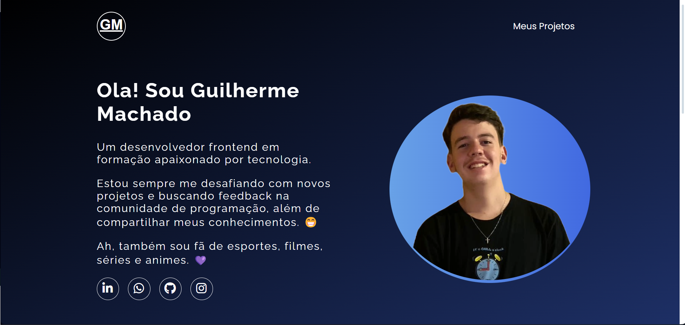

# Portfolio  💼
Este projeto consiste em uma portfolio, onde se enconta minha coleção organizada de projetos de programação, apresentados de forma acessíve.

## Tecnologias Usadas

- HTML5
- CSS3
- JavaScript

## Estrutura de Arquivos

- index.html
- src (Organizado com as respesctivas paginas Imagens; CSS; JS)
## Visualização

Aqui está uma prévia de como o site aparece(Clique na imagem caso queira acessar o site)

## Contato

- E-mail: guisilvam19@gmail.com ou  guilhermemachado019@gmail.com
- Projeto Link: https://guilherme-silvam.github.io/portfolio/